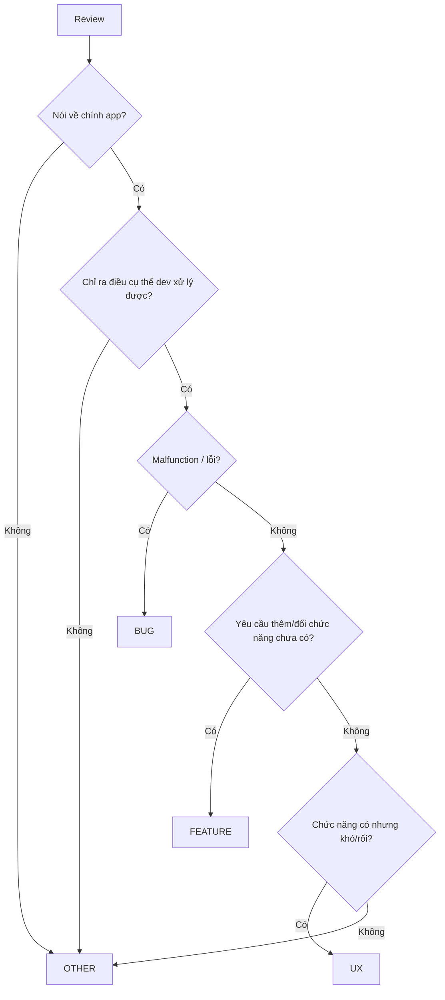

# Decision Tree

Cây quyết định gán nhãn 4 lớp (đồng bộ với `annotation_guideline_v1.md` và Hình trong đề cương §7.2).
Tầng 1 suy ra: ACTIONABLE = BUG ∪ FEATURE ∪ UX ; NOT_ACTIONABLE = OTHER.

```mermaid
flowchart TD
  A[Review] --> B{Nói về chính app?}
  B -- Không --> O[OTHER]
  B -- Có --> C{Chỉ ra điều cụ thể dev xử lý được?}
  C -- Không --> O
  C -- Có --> D{Malfunction / lỗi?}
  D -- Có --> BUG
  D -- Không --> E{Yêu cầu thêm/đổi chức năng chưa có?}
  E -- Có --> FEATURE
  E -- Không --> F{Chức năng có nhưng khó/rối?}
  F -- Có --> UX
  F -- Không --> O
```
